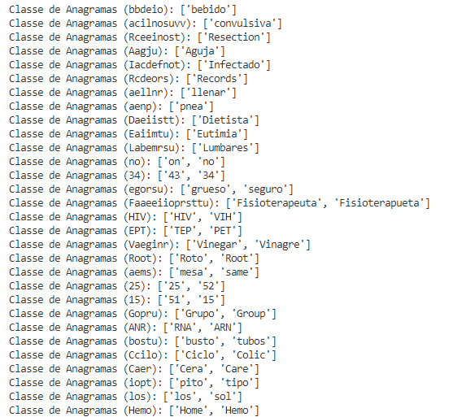

## Trabalho de casa 1

Neste exercício prático, era pretendida a resolução em _python_ de 10 enunciados, recorrendo e reconhecendo funções predefinidas e/ou o seu funcionamento, estruturas de dados e processos simples de manipulação de ficheiros de texto.

### Procedimento
Para este trabalho, foram executados os seguintes passos.

#### 1. Dada uma string s, revertê-la
Na resolução deste enunciado, foi utilizada a técnica de slicing que recorre à sintaxe s[::-1], sendo
que nesta é inidcado que deve ser corrida a string, do ínicio ao fim,
em passos de 1 em 1 no sentido do fim para o ínicio. Deste modo, é possível a
reversão da string.

#### 2. Dada uma string s, retornar quantos caracteres a e A estão presentes na mesma
Para este enunciado, foi executada uma contagem de cada um dos caracteres dentro da string, recorrendo
ao método de contagem em strings _count()_.

#### 3. Dada uma string s, retornar o número de vogais que estão presentes na mesma
A resolução deste exercício passou por uma definição inicial de uma lista contendo as vogais (a,e,i,o,u)
e percorendo a string letra a letra, verificando se cada uma se encontrava na lista definida. Em caso
afirmativo, num contador definido à partida, era adicionado mais um valor, retornando assim o valor final
de vogais presentes na string em questão.

#### 4. Dada uma string s, convertê-la para letra minúscula
Neste exercício, foi aplicado o método de strings _lower()_ que permite num só passo converter toda a string
em letra minúscula.

#### 5. Dada uma string s, convertê-la para letra maiúscula
Aqui, foi aplicado um processo semelhante ao anterior, recorrendo, porém, desta vez ao método _upper()_.

#### 6. Verifica se uma string é capicua
Uma capicua é uma expressão que permanece igual, mesmo após a inversão dos seus caracteres. Deste modo,
para este enunciado foi verificado se após a inversão da string esta permanecia inalterável, a nível de leitura,
e em caso afirmativo, confirmava-se a presença de uma capicua, retornando o valor verdadeiro (_True_) e, em caso
negativo, retornava o valor de verdade falso (_False_).

#### 7. Verifica se duas strings estão balanceadas
Neste caso, era pretendida a verificação da existência de todos os caracteres de s1 em s2. Para tal, foi efetuada
uma pesquisa, para cada letra de s1, na string s2 e à semelhança do exercício anterior, conforme o resultado dessa
análise, era retornado o valor de verdade ou falsidade (_True_ e _False_).

#### 8. Calcula o numero de ocorrencias de s1 e s2
Para esta situação, era necessária a verificação do número de vezes em que s1 se apresentava em s2, de modo integral.
Assim, tal como no segundo enunciado, é efetuada uma contagem, recorrendo ao método _count()_, da string s1 inteira, sendo
retornado um valor referente a esta quantidade.

#### 9. Verifica se s1 é anagrama de s2
Um anagrama resume-se, fundamentalmente, a duas ou mais palavras cujas letras presentes são as mesmas, porém numa ordem
diferente. Para a resolução deste enunciado é aplicada a função desenvolvida para analisar o balaceamento das strings s1 e s2,
ou seja, se as letras de s1 se encontram em s2 e verificado o comprimento das duas strings. Caso exista balanceamento entre as
strings e o comprimento de s1 e s2 forem iguais, isto significa que apresentam as mesmas letras, na mesma quantidade.

Deste modo, caso ambas as condições sejam verificadas em simultâneo, é retornado o valor de verdade para a existência de
anagramas e, em caso oposto, é apresentado o valor de falsidade.

#### 10. Dado um dicionário, calcular a tabela das classes de anagramas
Neste enunciado, é pretendida a obtenção de um dicionário que apresente grupos de anagramas,
retirados do texto fornecido num ficheiro. 

Visto que neste ficheiro se encontravam linhas de texto corrido, sinais de pontuação, linhas em branco,
caracteres incomuns ou desnecessários e letras minúsculas, bem como maiúsculas, de modo a tornar o processamento
do mesmo mais simples, é efetuado o tratamento destas situações e a uniformização da letra. Assim, foram removidos 
os caracteres __,__ , __.__ , __-__ , __/__ , __©__ , __/a__ , __)__ e __(__ , separado o texto e removidas as linhas em branco, utilizando o método 
de strings _split()_, bem como o método _lower()_, de modo a converter todo o texto em letras minúsculas.

Após este processo, foi efetuada a definição de um dicionário para guardar os anagramas, a remoção de palavras repetidas
(utilização do _set()_ permitindo a criação de um conjunto, uma estrutura de dados que armazena elementos únicos, sem uma ordem específica) e
a definição de uma função _ordenaLetras_ que permite a criação de uma chave com as letras das palavra por ordem alfabética para o dicionário referido.

Por fim, para a deteção de anagramas, foi aplicada a função _ordenaLetras_ a cada uma das palavras obtidas do texto, verificando-se se a mesma já se
encontrava entre as chaves do dicionário. Em caso negativo, significava que não existiriam anagamas associados a esta e, portanto, definia-se uma lista 
para os guardar, em seguida, todas as restantes palavras eram ordenadas segundo a função _ordenaLetras_ e, se estas fossem iguais à original, eram adicionadas
à lista, sendo esta, por fim, inserida no dicionário, associada à chave criada inicialmente.

Assim, obteve-se um dicionário de anagramas, sendo verificado, devido à extensão do dicionário, se existiriam palavras com
mais do que um anagrama associado.

Os resultados referidos podem ser observados na imagem seguinte: 

### Desafios
- Efetuar a remoção de caracteres indesejados no texto
- Remoção de acentos e cedilhas no texto
