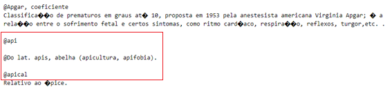
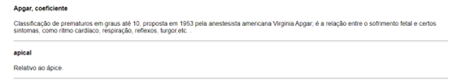
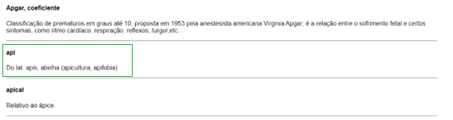
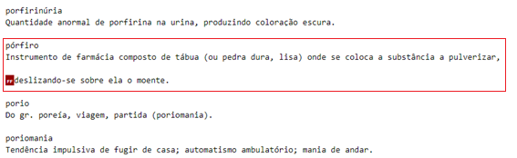
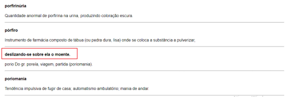
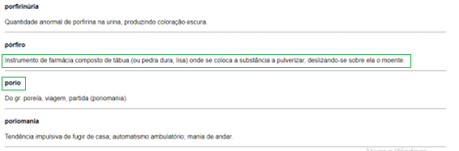
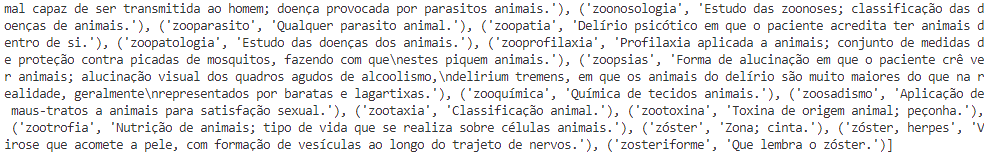
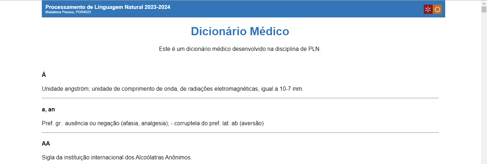

## Trabalho de casa 3

Neste projeto, era desejado o desenvolvimento de um algoritmo que permitisse a extração de informação de um dicionário em formato de texto (_txt_) para uma página _html_.

### Procedimento
Inicialmente, foi aberto o ficheiro de texto a partir do qual se pretendia extrair a informação. Neste estavam contidas designações dos termos e definições destes, parâmetros que se pretendia extrair separadamente.

-----------

#### Análise do documento (Padrões)

- Designações iniciadas por duas quebras de linha;
- Definições na(s) linha(s) imediatamente abaixo;
- Presença de quebras de página.

-----------

De modo a ser possível distinguir as designações das definições, foi inserido o símbolo **@** antes de todas as designações, por meio da aplicação do método _sub_ da biblioteca de expressões regulares, _re_. A este método, foi associado o padrão de procura **\n\n(.+)**, que no fundo indica algo começado por duas mudanças de linha, padrão que foi observado aquando da análise do documento, característico das designações. As expressões alinhadas com isto foram, então, substituidas pelo padrão **\n\n@\1**, responsável pela adição do caracter @ à expressão encontrada, matendo o restante.

Após a identificação das designações e definições, assim como de uma análise detalhada do documento resultante, foram identificadas substituições cuja natureza não era a mais correta, ocorrendo a presença de @ em definições, como se pode verificar na Figura 1. Tal comportamento foi associado à existência de quebras de página, identificadas na imagem como **FF** e reconhecidas em _python_ como **\f**.

<figure style="text-align: center;">
  
  <figcaption style="font-size: smaller; color: darkgray;">Figura 1. Quebras de Página.</figcaption>
</figure>

Quando transformado em _html_ (processo explicado posteriormente), este processo resultava no desaparecimento da designação e definição afetadas (Figura 2), o que não era de todo pretendido.

<figure style="text-align: center;">
  
  <figcaption style="font-size: smaller; color: darkgray;">Figura 2. Resultado das quebras de página em HTML.</figcaption>
</figure>

Para contornar esta situação, foi inserida a substituição do padrão **@(.+)\n\n@**, caracterizado por uma expressão,posterior a um @, seguida por duas quebras de linha e um novo sinal de @, identificando este comportamento, tendo-se, assim, duas linhas com texto sucessivas iniciadas por @, pelo padrão **@\1\n**. Deste modo, é mantido o primeiro sinal de @, associado à designação, assim como a expressão que o segue, removendo uma quebra de linha e um @, levando à estrutura definida neste documento para designações e definições.

Como resultado, obteve-se, então, a estrutura apresentada na Figura 3.

<figure style="text-align: center;">
  
  <figcaption style="font-size: smaller; color: darkgray;">Figura 3. Resolução da separação de designações e definições.</figcaption>
</figure>

Dada esta situação por terminada, foi detetada ainda uma nova questão a resolver. Em determinados locais do documento, a quebra de página apresentava-se no meio de uma definição (Figura 4), sendo parte da definição tomada como designação pelo algoritmo (Figura 5).

<figure style="text-align: center;">
  
  <figcaption style="font-size: smaller; color: darkgray;">Figura 4. Quebra de página no interior de uma definição.</figcaption>
</figure>

<figure style="text-align: center;">
  
  <figcaption style="font-size: smaller; color: darkgray;">Figura 5. Quebra de página no interior de uma definição em Html.</figcaption>
</figure>

De forma a resolver esta questão, foi aplicado o método de substituição _sub_, ao padrão **\n\n@\f([A-Za-z]+.+\.)\n(.+)**, que representa uma expressão iniciada duas linhas abaixo por uma letra, posterior a uma quebra de página, terminando num ponto final, seguida de uma outra expressão, presente na linha seguinte. Com este padrão, é fundamentalmente pretendida a identificação de definições divididas até encontrar uma designação. Esta expressão, foi substituida pelo padrão **\1\n\n@\2**, onde são removidas as duas linhas vazias iniciais, bem como o primeiro sinal @, separando a designação seguinte do final da definição em questão. Assim, obtem-se a estrutura pretendida, Figura 6.

<figure style="text-align: center;">
  
  <figcaption style="font-size: smaller; color: darkgray;">Figura 6. Resolução da quebra de página no interior de uma definição em Html.</figcaption>
</figure>

Terminado este processo, é efetuada a remoção de todas as quebras de página do ficheiro, através da aplicação do método _sub_, **re.sub(r'\f',"",texto)**.

De seguida, são armazenados os termos numa lista, recorrendo ao método _findall_ aplicado ao padrão **@(.+)\n([^@]+)\n\n**, onde **(.+)** é a designação e **([^@]+)** a definição (Figura 7).

<figure style="text-align: center;">
  
  <figcaption style="font-size: smaller; color: darkgray;">Figura 7. Excerto da lista de Termos.</figcaption>
</figure>

Uma vez obtida esta lista, é necessário efetuar a passagem dos termos para a página html, sendo esta iterativamente efetuada, inserindo por linha cada parte do tuplo portador das definições e designações, sendo as mesmas inseridas nesta ordem.

Por fim, foi aplicada a estilização do ficheiro, originando o resultado apresentado na Figura 8.

<figure style="text-align: center;">
  
  <figcaption style="font-size: smaller; color: darkgray;">Figura 8. Resultado final.</figcaption>
</figure>

### Desafios
- Procurar prever e resolver todas as situações criadas pela existência de quebras de página.
