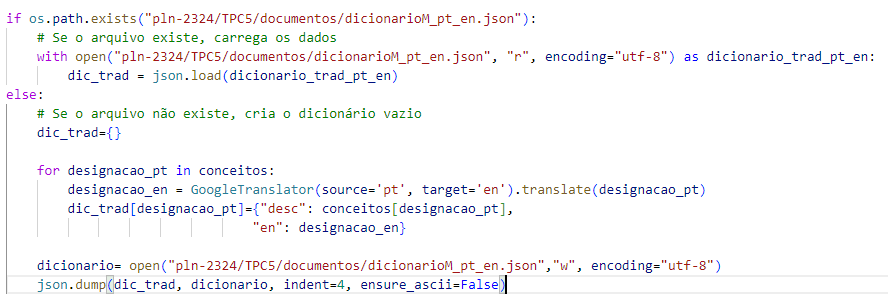
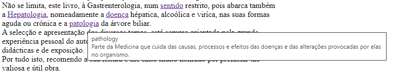

## Trabalho de casa 5

Com este projeto era pretendido o desenvolvimento de uma página _html_ onde estivesse presente o conteúdo de um livro médico no qual às palavras presentes num dicionário de conceitos, fosse adicionada uma região aquando do _hover_, onde estivesse presente a tradução do termo em inglês e a sua definição.

### Procedimento
De modo a conseguir obter o resultado pretendido, foi necessário, inicialmente, carregar os documentos relativos ao dicionário de conceitos e o livro médico. 

Posteriormente foi necessário efetuar as traduções das chaves do dicionário de conceitos, criando um novo dicionário que alojasse a seguinte estrutura: {designação: {descrição:"", tradução:""}}, de modo a ser mais simples o acesso a cada parte da informação. Porém, o processo de tradução dos termos é muito demorado, tornando-se pouco viável a sua repetição. Assim sendo, a nova estrutura passou a ser guardada num ficheiro _json_ aquando do primeiro processo de tradução, sendo posteriormente somente necessária a verificação de existência deste, o qual é lido e a informação presente neste carregada para uma variável temporária.

 

Uma vez tendo a informação quer das traduções como das definições dos termos, são substituidas as mudanças de linha (\n) e as quebras de página (\f) presentes no livro médico por _tags_ reconhecidas por _html_ (\  e \
, respetivamente). Este processo foi efetuado com a intenção de estruturar melhor a página obtida no final, não interferindo diretamente com o conteúdo.

Posteriormente, são procuradas no livro as palavras cujos conceitos estão presentes no dicionário anterior e estas são substituidas por etiquetas, nas quais é apresentada a palavra normalmente, porém quando _hover_, são apresentadas a tradução da palavra e a sua definição.

 

Por fim, este texto modificado com etiquetas é inserido num ficheiro _html_, tal como pretendido.

### Desafios
- Garantir que não seria necessário efetuar a tradução dos termos todas as vezes que se corresse o código, visto que era dispendido demasiado tempo nesse processo.
