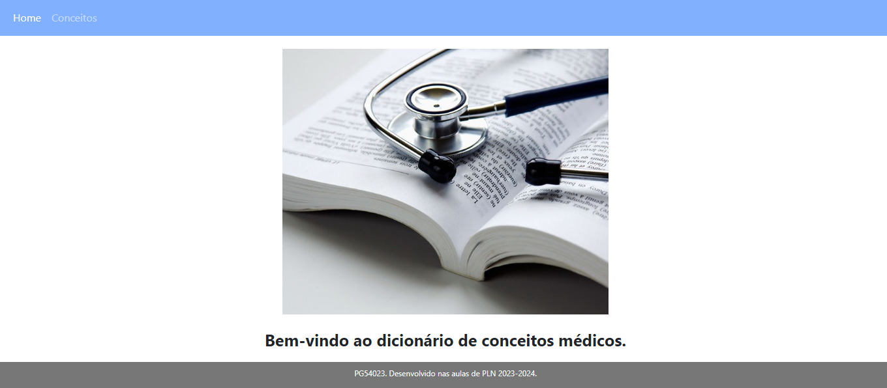
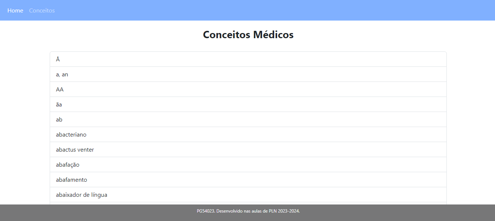
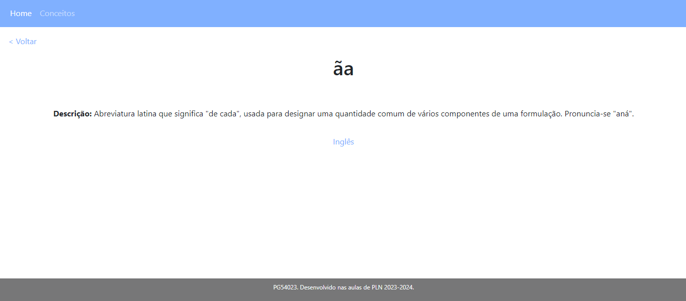
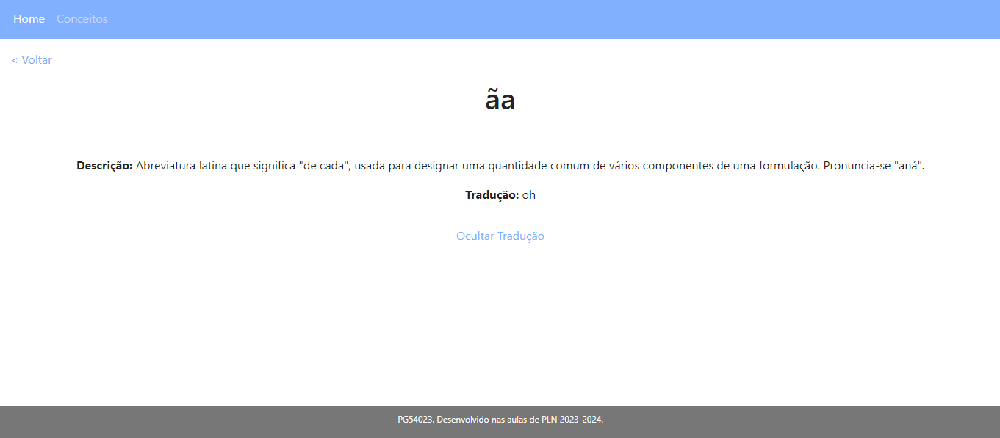

## Trabalho de casa 6

Neste enunciado era pretendido o desenvolvimento de um dicionário médico básico recorrendo à ferramenta Flask, sendo possível visualizar uma listagem de conceitos e em cada um a sua definição e tradução em inglês.

### Procedimento
Para desenvolver o que era pretendido, foi necessária a criação de um menu em _python_ que associava 3 ficheiros _html_ a diretorias específicas (a página principal- _homepage_, a página da listagem de conceitos e as páginas relativas a cada conceito) recorrendo à ferramenta Flask. Foi criado mais um ficheiro _html_ com o intuito de estabelecer um formato geral para o _header_ e o _footer_.

Foram assim, tal como referido acima, criados 3 tipos de página.

Iniciando pela **página principal** ou _homepage_, foi inserida uma **imagem** e um **título**, formatando-os para que se adaptassem corretamente à página.

 

Passando para a página dos **conceitos**, foi inserida nesta uma listagem de conceitos médicos, provenientes das chaves do dicionário presente em _conceitos2.json_ . Tal foi conseguido através de um **_ciclo for_** estabelecido no corpo da página _html_ em questão, **a partir do qual se adicionava a esta lista as chaves referidas**.

 

Por fim, para a página de cada **conceito**, foi desenvolvido um **botão para Voltar**, associado à página anterior (/conceitos), assim como um **botão que permite abrir a tradução em inglês e fechar a mesma**. Relativamente à **definição** do conceito, esta foi adicionada **através da referenciação da chave desc do dicionário do conceito em específico passado como parâmetro à página html (_conceito.desc_)**. Adicionalmente, visto que em português existem muitos **caracteres especiais**, foi necessário **protegê-los através do acréscimo de _|safe_** após a chave do conceito.

 

### Desafios
- Proteger os caracteres especiais das definições;
- Personalizar a abertura e fecho da tradução.
