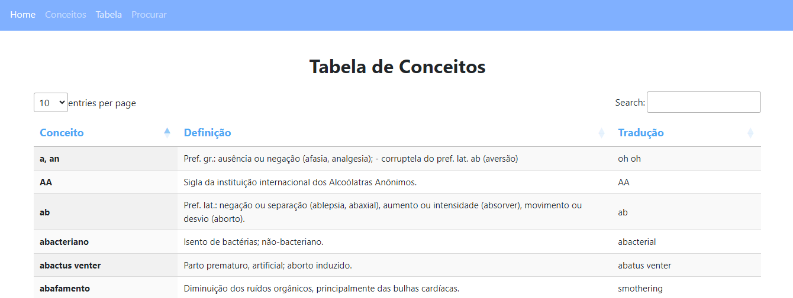
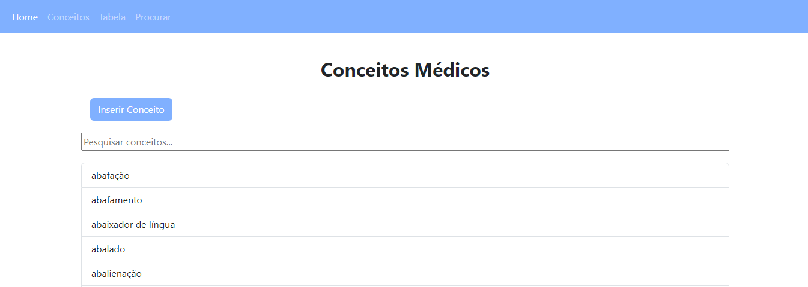
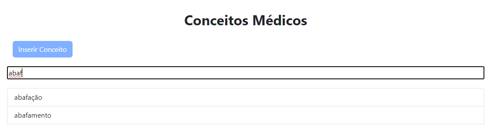
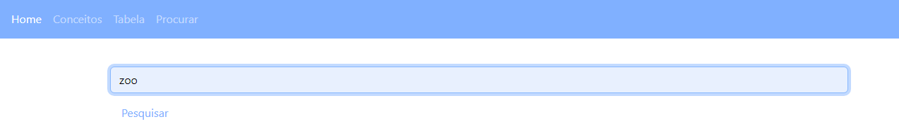
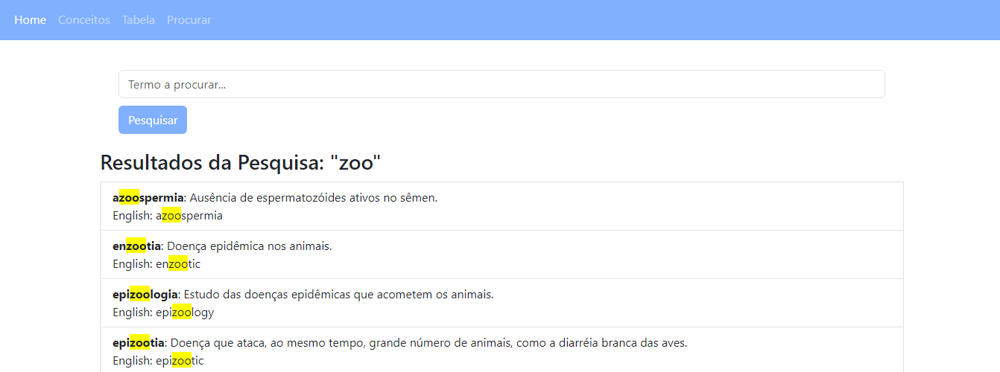

## Trabalho de casa 7

Para este trabalho prático era pretendido o desenvolvimento de duas funcionalidades adicionais para a aplicação referente ao dicionário de conceitos médicos. Estas funcionalidades seriam, então, uma _datatable_ contendo informação relativa aos conceitos, as suas definições e traduções, assim como um meio de pesquisa de conceitos ou termos em geral.

### Procedimento

#### 1. Datatable

1.1. Template HTML

Para a criação da _datatable_, foi necessária a criação de um **_template_ htlm** no qual foi implementado o **código de estruturação da tabela (originário do _bootstrap_)**, adaptado ao conteúdo a apresentar. Neste caso, pretendia-se que a tabela fosse constituida por **3 colunas relativas ao conceito, à designação e à tradução deste**, estando em cada linha presente um conceito da base de dados (ficheiro json).

1.2. Alteração dos caminhos

Estando criado o template, foi necessário inclui-lo na aplicação, recorrendo ao ficheiro _python_ e estabelecendo o _url_ para o acesso a esta funcionalidade **"/tabela"**.

Após a aplicação deste processo, obteve-se o resultado presente na Figura 1.

 <b>Figura 1</b>- Datatable.

#### 2. Pesquisa
Para a definição de um sistema de pesquisa, foram desenvolvidas duas soluções:

- **2.1) Opção 1**

    Nesta opção seguiu-se por uma abordagem mais simples, na qual se estabeleceu uma **barra de pesquisa na página /conceitos**, que permitia a apresentação de conceitos nos quais estivesse presente o termo procurado e ocultar os restantes.

    Para isto foi utilizada uma função em JavaScript, resultando no efeito apresentado nas Figuras 2 e 3.

    
    
 <b>Figura 2</b>- Procura de conceitos (Opção 1).

     

    
    
 <b>Figura 3</b>- Procura de conceitos (Opção 1): Resultado.

     

- **2.2) Opção 2**

    Foi encontrada ainda uma segunda alternativa, tal como referido, que consistia na criação de um _template_ html e estabelecimento de urls especificos para um **sistema de procura envolvendo conceitos, assim como as suas descrições e traduções**. Assim, seriam obtidos resultados nos quais o termo procurado poderia pertencer a qualquer umas destas 3 classes.

    2.2.1. Template HTML

    Foi, assim, definido um **_template_ html**, no qual foi estabelecido um **formulário associado ao método _post_**, no qual seria inserido o termo a procurar. Posteriormente, seria apresentada uma **listagem de resultados nas quais apareceriam conceitos, descrições e traduções nas quais constassem o termo definido**, sendo que este se apresentaria destacado a amarelo.

    2.2.2. Alteração dos caminhos

    Estando construido o _template_, foi necessário **estabelecer o _url_** associado a esta funcionalidade, **"/pesquisa"**, o qual estaria associado quer a um **método de _post_ (devido ao formulário)**, assim como ao **método de _get_ (para apresentação dos resultados)**. Nesta função, é **verificada a existência do termo procurado nos conceitos e suas propriedades** presentes na estrutura de dados json, sendo criado um dicionário somente com os conceitos que correspondem aos requisitos da procura, o que serviria de base para a apresentação de resultados pelo _template_.

    Os resultados desta implementação podem, então, ser averiguados através das Figuras 4 e 5.

    
    
 <b>Figura 4</b>- Procura de conceitos (Opção 2).

     

    
    
 <b>Figura 5</b>- Procura de conceitos (Opção 2): Resultado.

     