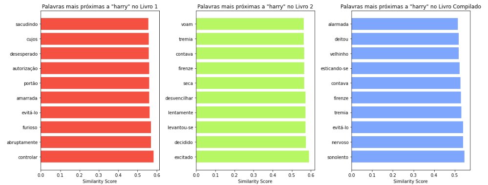
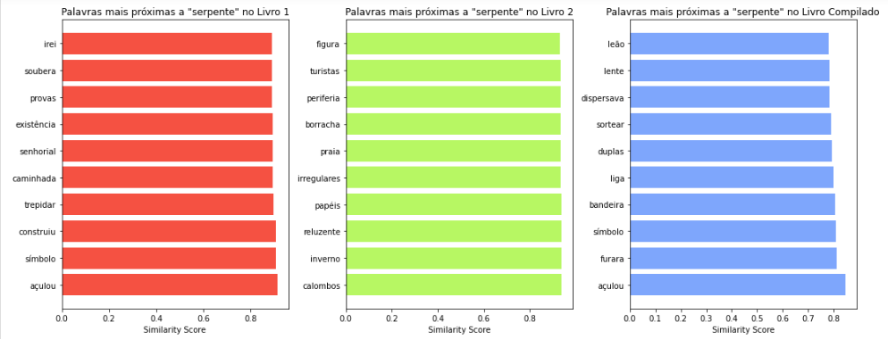
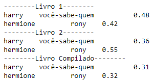
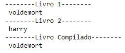
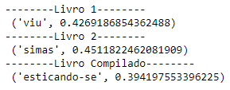
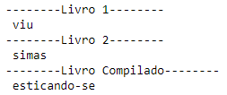

## Trabalho de casa 8

Neste trabalho prático foram desenvolvidas diversas funcionalidades relacionadas ao processamento de texto recorrendo a 
técnicas de _**Word Embedding**_.
Este termo refere-se a uma técnica da área de processamento de linguagem natural (PLN) usada para representar palavras 
num espaço vetorial contínuo onde a proximidade no espaço reflete semelhanças semânticas entre as palavras. Ou seja, palavras 
semanticamente semelhantes são mapeadas em pontos próximos no espaço vetorial.

### Procedimento

##### 1. Carregamento dos Dados

Os dados foram carregados a partir de dois arquivos de texto referentes aos livros **"Harry Potter e a Câmara Secreta"** e 
**"Harry Potter e a Pedra Filosofal"**.

##### 2. Tokenização dos Textos

Cada texto foi tokenizado em palavras utilizando a função _**word_tokenize**_ do NLTK (Natural Language Toolkit), convertendo 
as palavras para minúsculas e dividindo o texto em linhas.

##### 3. Criação dos Modelos Word2Vec

3.1. Criação dos Modelos Individuais

Foram criados modelos para cada um dos livros utilizando a classe _Word2Vec_ da **biblioteca Gensim**. Cada modelo 
foi treinado com os _tokens_ correspondentes ao texto do livro, utilizando os parâmetros de vetorização, janela, contagem mínima, algoritmo de treino e número de _epochs_ especificados.

3.2. Criação do Modelo Compilado

Além dos modelos individuais, foi criado um modelo _Word2Vec_ compilado a partir da junção dos _tokens_ dos dois livros. Esse modelo foi treinado com os _tokens_ compilados utilizando os mesmos parâmetros dos modelos individuais.

#### 4. Análise dos Resultados

4.1. Palavras Associadas a "Harry"

Para cada um dos modelos, foram identificadas as palavras mais associadas a "Harry" utilizando o método _**most_similar**_ da classe _Word2Vec_.

Os resultados destas associações foram, posteriormente, representados em **gráficos**, tornando mais fácil a sua leitura e compreensão.
Estes podem ser observados na Figura 1.

<figure style="text-align: center;">
  
  <figcaption style="font-size: smaller; color: darkgray;">Figura 1. Apresentação de resultados - Palavras próximas de "harry".</figcaption>
</figure>

 

4.2. Palavra "serpente"

Para investigar palavras semanticamente associadas à palavra "serpente", foi utilizado o método **_most_similar_** do modelo _Word2Vec_. 
Este método retorna as palavras mais semelhantes à palavra fornecida, permitindo entender o contexto em que a mesma é comumente utilizada nestes textos.

<figure style="text-align: center;">
  
  <figcaption style="font-size: smaller; color: darkgray;">Figura 2. Apresentação de resultados - Palavras próximas de "serpente".</figcaption>
</figure>

 

4.3.1.  Relação entre "Harry" e "Você-Sabe-Quem"

Utilizando o método **_most_similar_**, explorou-se as palavras semanticamente mais próximas de "Harry" e "Você-Sabe-Quem" no espaço vetorial. 
Esta análise fornece _insights_ sobre a relação entre as duas personagens-chave na série "Harry Potter".

4.3.2.  Relação entre "Hermione" e "Rony"

Da mesma forma, investigou-se as palavras mais próximas semanticamente de "Hermione" e "Rony" utilizando o método **_most_similar_**. 

<figure style="text-align: center;">
  
  <figcaption style="font-size: smaller; color: darkgray;">Figura 3. Apresentação de resultados - Associações harry/você-sabe-quem e hermione/rony nos livros.</figcaption>
</figure>

 

4.4. Identificação do "intruso"

Por meio do método **_doesnt_match_**, identificamos o "intruso" entre as palavras "Harry", "frigideira" e "Voldemort". 
Este método retorna a palavra menos associada às restantes.

<figure style="text-align: center;">
  
  <figcaption style="font-size: smaller; color: darkgray;">Figura 4. Apresentação de resultados - Identificação do "intruso".</figcaption>
</figure>

 

4.5. Investigação da relação entre "Harry" e "Rony" sem "Hermione"

Nesta análise, exploramos as palavras semanticamente associadas a "Harry" e "Rony", excluindo qualquer relação com "Hermione". 
Utilizando novamente o método **_most_similar_**, conseguimos entender a dinâmica entre as primeiras personagens quando 
a terceira personagem principal não está envolvida.

<figure style="text-align: center;">
  
  <figcaption style="font-size: smaller; color: darkgray;">Figura 5. Apresentação de resultados - Relação entre "Harry" e "Rony" sem "Hermione".</figcaption>
</figure>

 

4.6. Identificação da analogia mais forte entre "Harry" e "Rony" sem "Hermione"

Por fim, procurou-se uma palavra que representasse uma relação mais forte entre "Harry" e "Rony" do que a própria palavra "Rony", 
quando "Hermione" não estava envolvida. Esta análise permite identificar uma conexão específica entre as personagens em determinados contextos.

<figure style="text-align: center;">
  
  <figcaption style="font-size: smaller; color: darkgray;">Figura 6. Apresentação de resultados - Analogia mais forte entre "Harry" e "Rony" sem "Hermione".</figcaption>
</figure>

 

### Conclusões interessantes
Após a execução deste trabalho prático, conclui-se que através das análises efetuadas aos textos são fornecidos _insights_ valiosos sobre as relações entre, não só as palavras, mas também
as personagens dos livros "Harry Potter", revelando nuances semânticas e dinâmicas complexas.